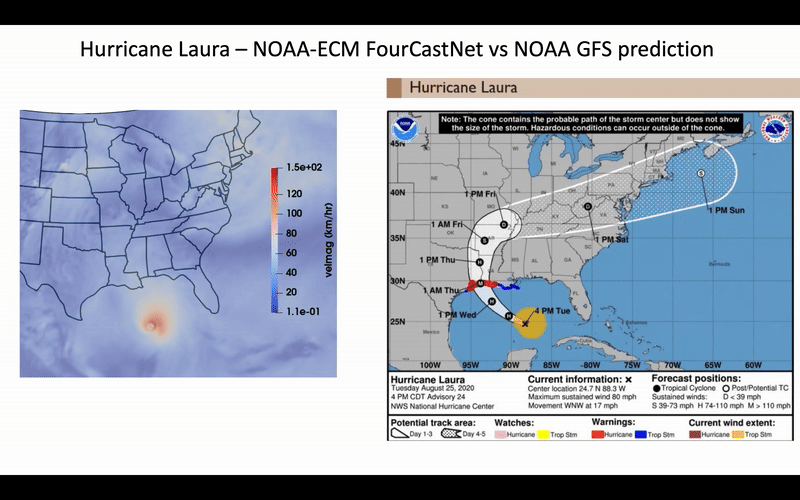
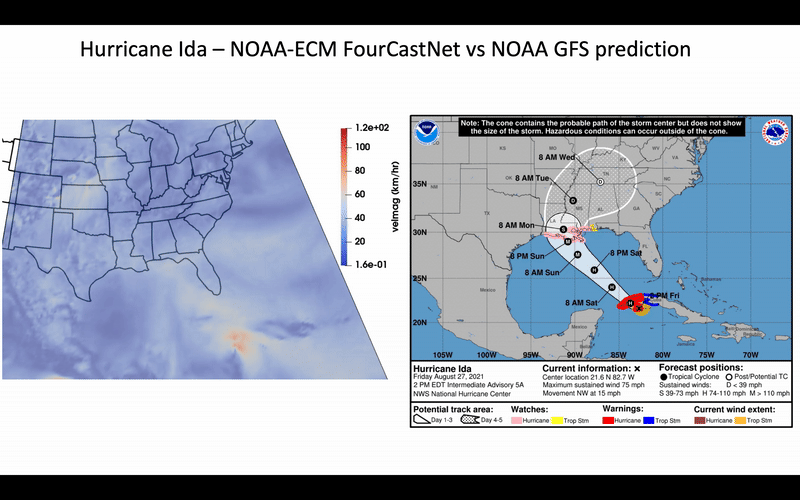
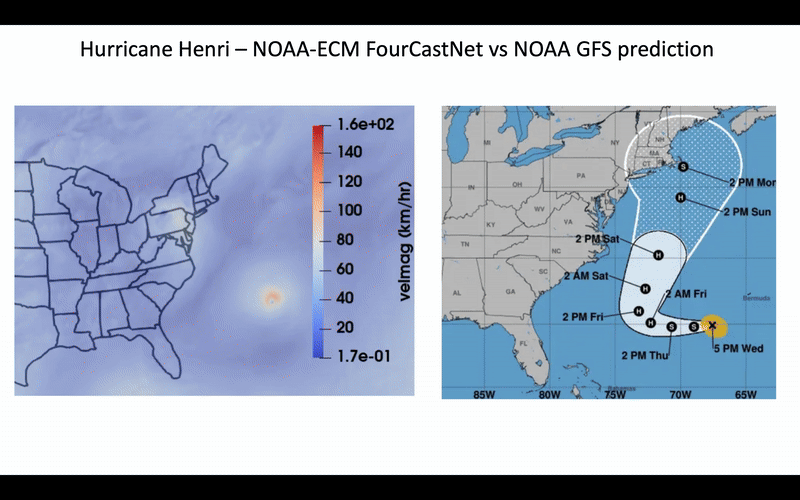

# NCEP Implementation of FourCastNet model using GDAS data as ICs
We use ECMWF's [ai_models_fourcastnetv2](https://github.com/ecmwf-lab/ai-models-fourcastnetv2/tree/main) plugin to run the model. FoureCastNet v2-small applies Spherical Fourier Neural Operators ([SFNOs](https://arxiv.org/abs/2306.03838)) as neural network architecture.

## Prerequisites
The following packages are needed:
- numpy
- boto3
- xarray
- pygrib
- torch
- ai-models-fourcastnetv2
- iris
- iris_grib
- eccodes
- cf_units

## Run the model

### Download pre-computed stats

```bash
wget https://get.ecmwf.int/repository/test-data/ai-models/fourcastnetv2/small/weights.tar
```

```bash
wget https://get.ecmwf.int/repository/test-data/ai-models/fourcastnetv2/small/global_means.npy
```

```bash
wget https://get.ecmwf.int/repository/test-data/ai-models/fourcastnetv2/small/global_stds.npy
```

### Get input data (initial conditions) from GDAS product
The script ncep/gdas.py can be used to prepare input data, simply use:

```bash
python gdas.py YYYYMMDDHH -s <s3 or nomads> -m <wgrib2 or pygrib> -k <yes or no>
```

file `input_YYYYMMDDHH.npy` will be created and saved in the current firectory.

### Run FourCastNetv2 in inference mode
Run inference using

```bash
python inference.py YYYYMMDDHH -w </path/to/weightsandstats> -i </path/to/input/input_YYYYMMDDHH.npy> -o </path/to/output/> -l <forecast-hours>
```

### Output
The forecast results will be saved in GRIB2 format.

#### Products:

The FourCastNetGFS model runs 4 times a day at 00Z, 06Z, 12Z, and 18Z cycles. The horizontal resolution is on 0.25 degree lat-lon grid. The vertical resolutions are 13 pressure levels.

The 13 pressure levels include:
50, 100, 150, 200, 250, 300, 400, 500, 600, 700, 850, 925, and 1000 hPa.

The model output fields are:

- 3D fields on pressure levels:
   temperature  
   U and V component of wind  
   geopotential height  
   relative humidity  
   
- 2D surface fields:
   10-m U and V components of wind  
   100-m U and V components of wind  
   2-m temperature  
   mean sea-level pressure  
   Precipitable water in the entire atmosphere as single column  
   
The near real-time forecast outputs along with inputs are available on AWS.
   
For each cycle, the dataset contains input files to feed into FourCastNet found in the directory:
   
        'fourcastnetgfs.yyyymmdd/hh/input_yyyymmddhh.npy'
   
and 10-day forecast results for the current cycle found in the following directories:
   
        'fourcastnetgfs.yyyymmdd/hh'


## Examples
This section contains some examples for inference. Hurricanes in years 2020 and 2021 are considered.

1. Create a directory `WeightsAndMeans`, and download the following into that directory.
```
wget https://get.ecmwf.int/repository/test-data/ai-models/fourcastnetv2/small/weights.tar
wget https://get.ecmwf.int/repository/test-data/ai-models/fourcastnetv2/small/global_means.npy
wget https://get.ecmwf.int/repository/test-data/ai-models/fourcastnetv2/small/global_stds.npy
```

2. Consider Hurricane Laura that formed on August 26, 2020. The following script downloads the input file 
from GFS on August 26, 2020 UTC 00:00, and writes a `.npy` file, that will be used as input for inference.  
```
python3 gdas.py 2020082600 -s nomads -m pygrib -k yes
```
3. Run the inference for 120 hours. The output files (every 6 hours) in grib2 format will be written into the   
Output directory.
```
python3 inference.py 2020082600 -w WeightsAndMeans -i input_2020082600.npy -o Output -l 120
```

Use 2021082700 for hurricane Ida and 2021081900 for hurricane Henri. The animations below show the results of 
the inference showing the velocity magnitude (km/hr) for the hurricanes, along with the NOAA prediction.






